## Deploy an inference API on AWS (EC2) using FastAPI Docker and Github Actions

To learn more about this project: [medium blog post](https://towardsdatascience.com/how-to-deploy-a-machine-learning-model-with-fastapi-docker-and-github-actions-13374cbd638a)


The goal of this project is to streamline the process of building and deploying an inference API on AWS using Docker and Github actions.

The API's goal is to anonymize text data by detecting named entities (names, organizations, locations) and returning an anonymized text.

Here's a highlevel overview of the API.

<p align="center">
    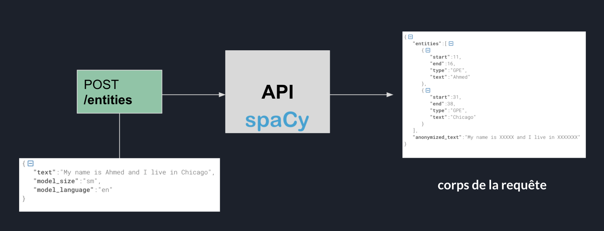
</p>

## 1- Develop the app locally

The API route is defined in `api/main.py`

A Dockerfile is defined to create an image for this API: pretty standard.

A docker-compose to manage services between others (as for now, there's only one service: the API)

## 2- Launch an EC2 instance

Connect to your AWS account, go the EC2 section and pick a distribution. I recommend Ubuntu 20.04 LTS for this tutorial.

<p align="center">
    
</p>

Pick an instance: we're not gonna go crazy here. We'll just pick a relatively small one: a `t2.medium`.

<p align="center">
    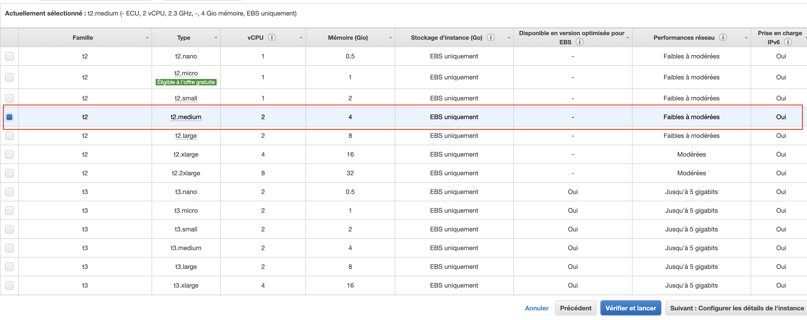
</p>

I changed the default storage to 30GB but you can leave it to 8GB (default value)

<p align="center">
    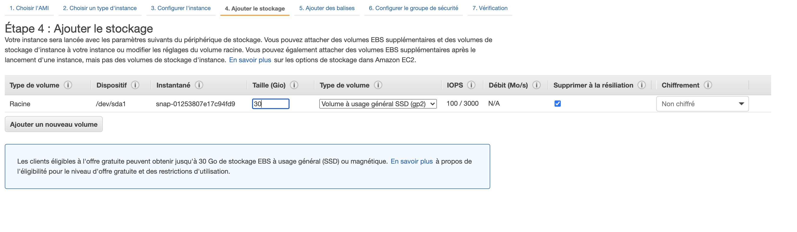
</p>

Now launch the instance.

Create an elastic IP address and associate it to the running instance. This way this IP won't change everytime the we restart the instance.

<p align="center">
    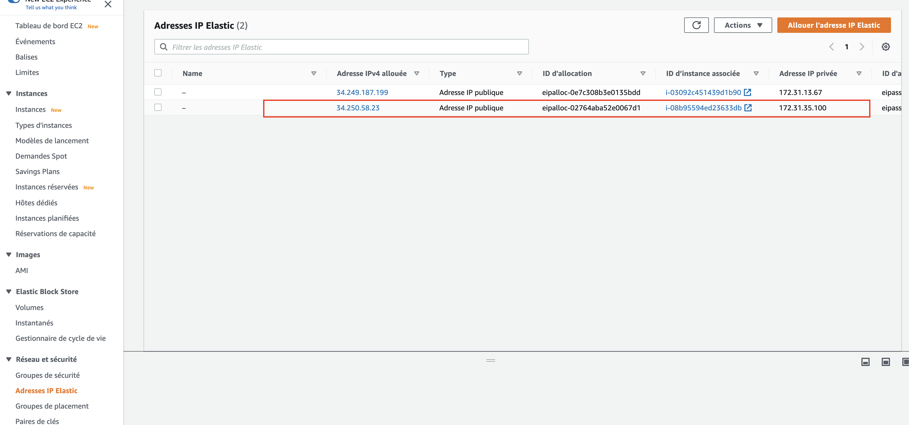
</p>

Add a new security group (I named it fastapi) to allow inbound traffic on port 8000.

<p align="center">
    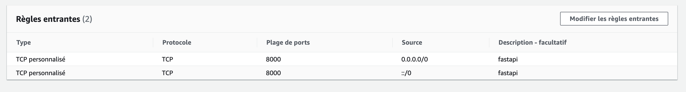
</p>

Then add to the instance security groups:

<p align="center">
    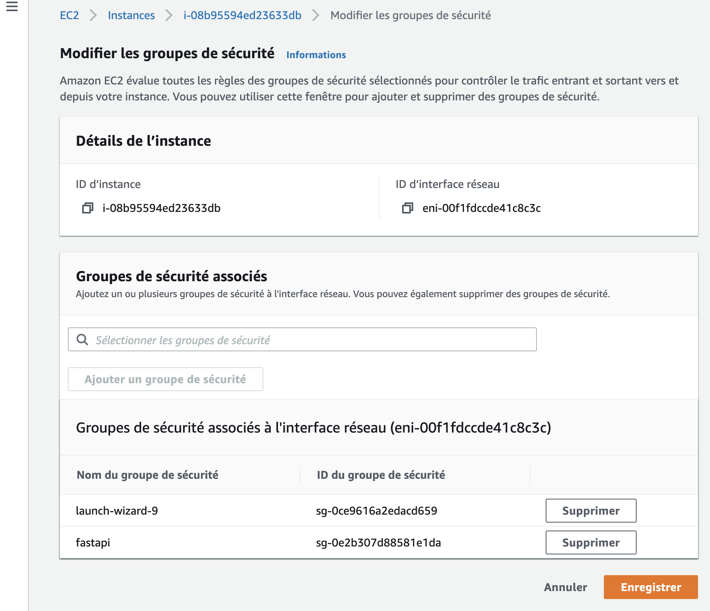
</p>

Now the instance is ready to accept requests.

## 3- SSH to the instance and configure it

SSH into the instance using your terminal.

- Install `docker` and `docker-compose` by following the official Docker [documentation](https://docs.docker.com/engine/install/ubuntu/)

- Generate an ssh key and add it to your Github account so that it can perform git clones seamlessly

## 4- Configure a Gihub Actions workflow

1- Go to your repo and click on the **Actions** tab

<p align="center">
    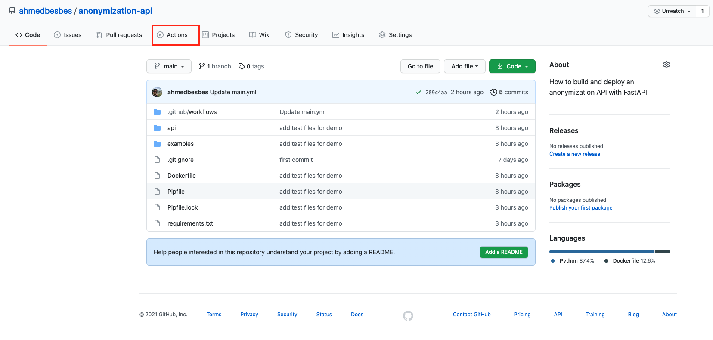
</p>

2. Click on **setup a workflow yourself**

<p align="center">
    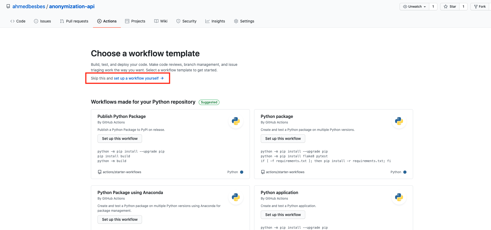
</p>

3. Define your workflow

A YAML file will be automatically created inside a `workflows` folder which will be itself created in a `.github` folder at the root of the repo.

The workflow will be triggered on **push requests** only (on the main branch)

<p align="center">
    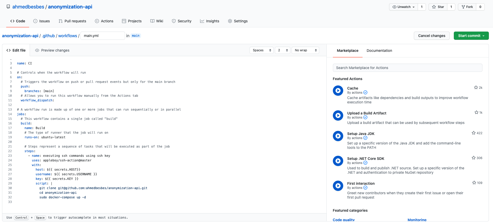
</p>

The job that will be triggered will be run on a remote server that Github Actions will connect to through the **SSH Remote Commands** custom Github Action that you can find from the marketplace.

<p align="center">
    
</p>

The **SSH Remote Commands** Github Action will be called with the following arguments

- host: the hostname of the server (i.e. its public IP)
- username: the ssh username
- key: the content of ssh private key
- script: the script that will be executed once the ssh connection is established

The script will list the commands that will be run on the server once the SSH connection is established: it'll clone the repo, cd into it and run the docker-compose build and up commands.

```bash
git clone git@github.com:ahmedbesbes/anonymization-api.git
cd anonymization-api
sudo docker-compose build
sudo docker-compose up -d
```

4. Define Github secrets

The previous arguments `host`, `username` and `key` will not be hard-coded in the YAML file.

They will rather be stored as Github secrets and referenced with the $ sign, the same way you would call environment variables.

To create Github secrets, go to the settings of the repository and click on **Secrets** on the left tab.

<p align="center">
    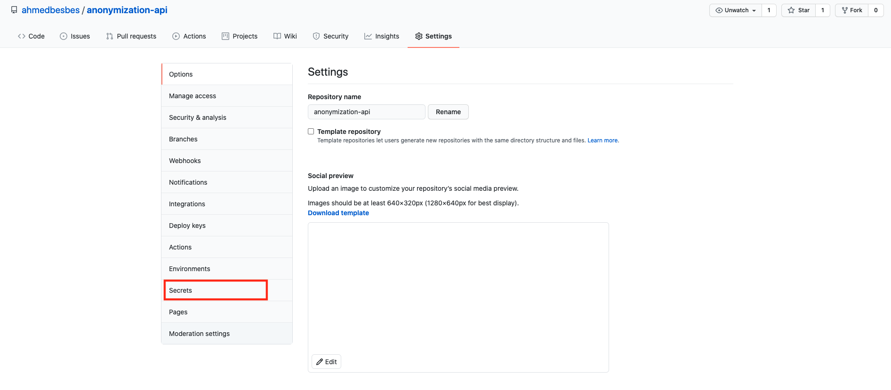
</p>

Then define your secrets by giving setting their name (in capital letters) and their value.

<p align="center">
    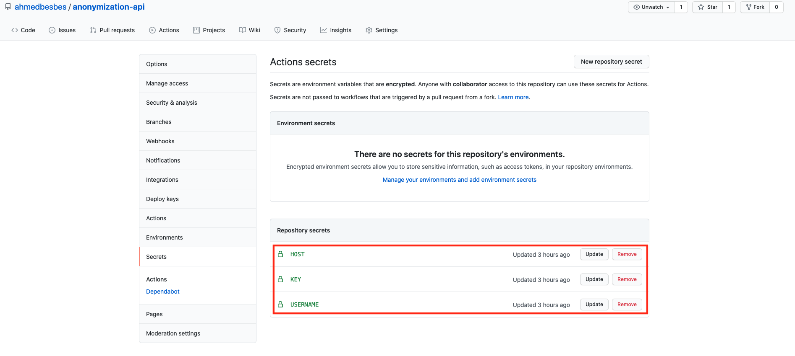
</p>

Here's how you would set the `USERNAME` secret for example.

<p align="center">
    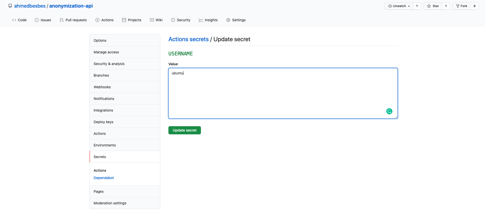
</p>

5. Commit, push and look out for the magic happening

Once you push your code (after testing that everything works fine locally) you will notice a new run queued to start.

<p align="center">
    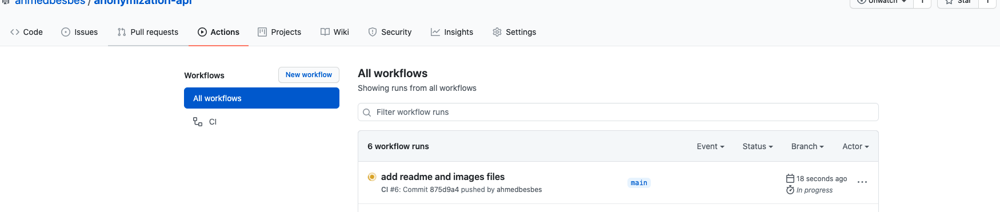
</p>

By clicking on it, you can see the different steps of the build.

<p align="center">
    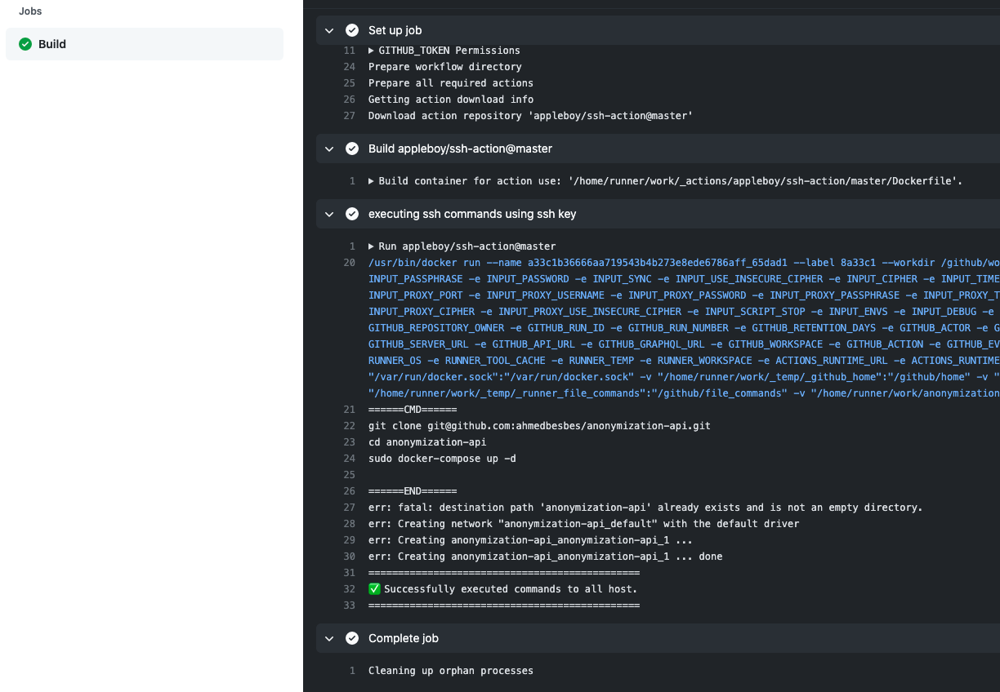
</p>

6. Check that everything is working

Once the API is successfully deployed on your remote server, fire up Postman and execute some requests on the API endpoint.

<p align="center">
    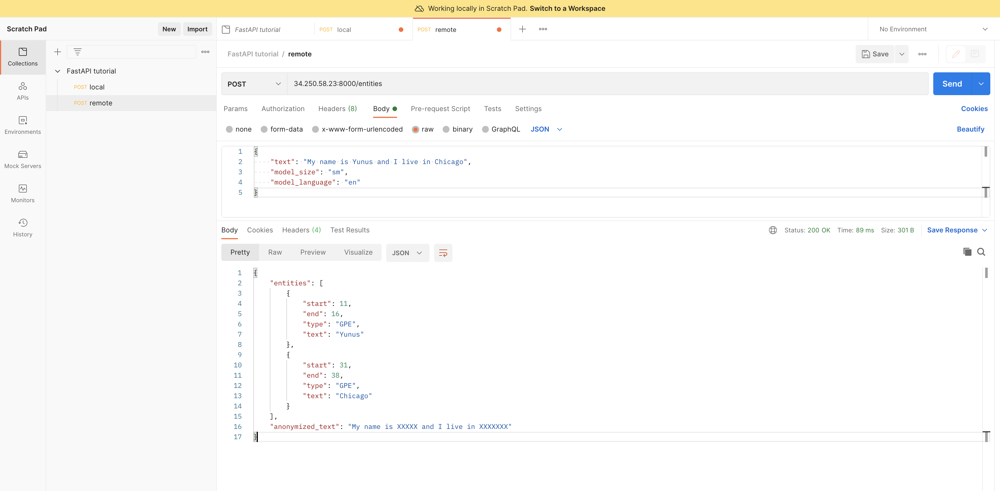
</p>
